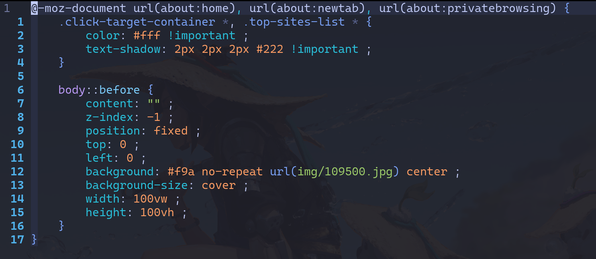

## How to change the background in firefox 

1.Go to about:support in the address bar. View the section "Application Basics" ➔ Profile Directory (or "Profile Folder" on MacOS) ➔ click the button "Open Directory" (or "Show in Finder" on MacOS):

2.Create a directory called chrome inside the opened directory, if it's not already there.

3.Go to the chrome directory and (a) create a directory called img and (b) create a file called userContent.css. Move your image to the img directory.

4.Open userContent.css in any text editor and paste the following code:

5.Go to the url about:config, accept the risk (we will not really do anything harmful here, nothing to worry about), and in the Search Bar, paste toolkit.legacyUserProfileCustomizations.stylesheets, and set the value to true. This tells Firefox to load the CSS file at startup.

6.Restart Firefox if it's running.
